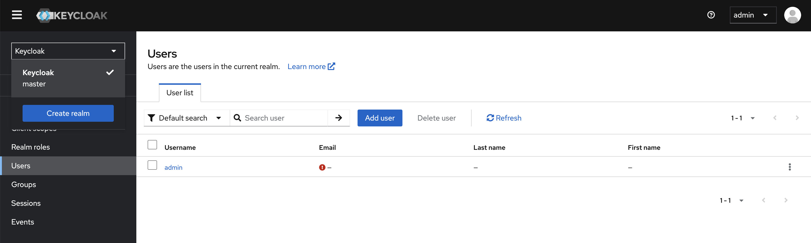
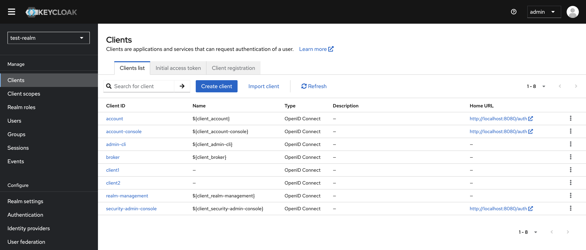
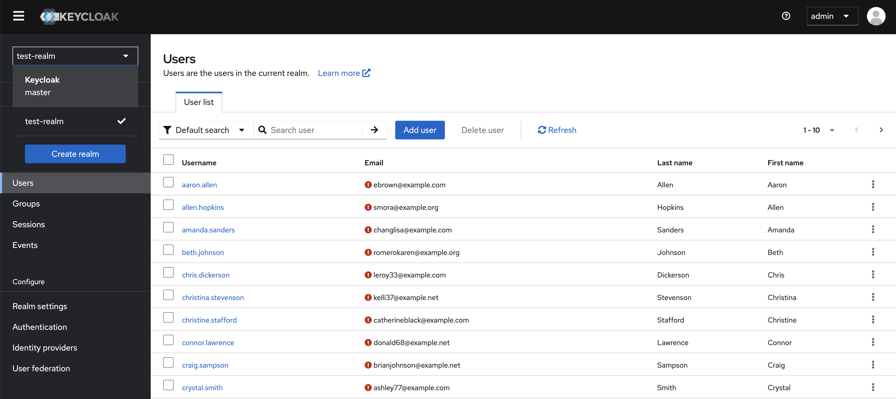

# Keycloak

Open Source Identity and Access Management - Keycloak provides user federation, strong authentication, user management, fine-grained authorization, and more.

[GitHub](https://github.com/keycloak/keycloak)

## Steps for Migration (verified on M1 Mac)

1. Run Keycloak with PostgreSQL database in Docker:

```
docker-compose -f kc-postgres-docker-compose.yaml up
```
Visit UI at http://localhost:8080 and Login using default credentials specified in .env



2. Generate data for Keycloak - Create realm, clients and users.

```
pip install -r requirements.txt
python kc_data_generator.py
```
Visit UI at http://localhost:8080, Login using default credentials and verify realm, clients and users are created.





3. Run YugabyteDB in Docker:

```
docker network create db_migration_network
docker-compose -f yb-docker-compose.yaml up
```

4. Execute offline migration.
- Offline migration: https://docs.yugabyte.com/preview/yugabyte-voyager/migrate/migrate-steps/
- Install YB-Voyager: https://docs.yugabyte.com/preview/yugabyte-voyager/install-yb-voyager/#install-yb-voyager

5. Verify schema and data parity between PostgreSQL and YugabyteDB.

6. Run Keycloak with YugaByte database in Docker:

```
docker-compose -f kc-yb-docker-compose.yaml up
```
Visit UI at http://localhost:8080 and Login using default credentials specified in .env. Verify realm, client and users data is present.
